### Overview
**N**eony**x** **P**rotocol **N**ode is main building block for [Neonyx Ecosystem](https://neonyx.io). 
It is used as a server to store and transfer data accross the network, to unlock all the power of distribute event-messaging.

### Architecture
Each Nxp-Node have structure below. [terminology](terminology/README.md)

